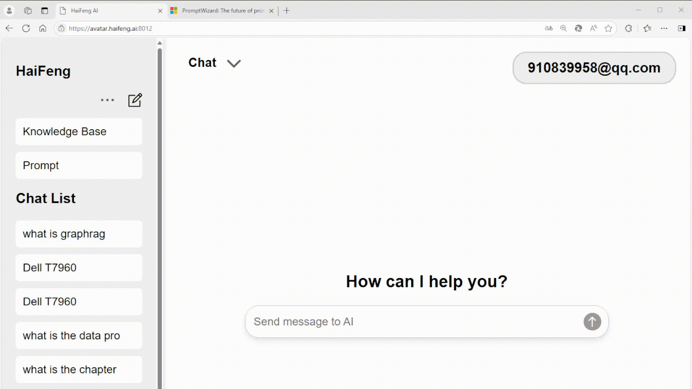

[中文](README_CN.md) ｜ English

# OpenKAG (Open Knowledge Augmented Generation)

## 1. Introduction

### OpenKAG is an enterprise intelligent knowledge platform based on large model technology. It features open-source availability, private deployment, and support for multi-modal processing. It can preprocess and analyze images, PDFs, and other documents. It is also the first enterprise knowledge assistant in China to integrate knowledge graphs with large-model RAG applications.

### The platform aims to create a self-controllable, out-of-the-box, offline, and secure enterprise knowledge platform.

### Key Features

- **Two Knowledge Retrieval Modes**:  
  OpenKAG offers two knowledge retrieval modes within its conversational functionality. The standard retrieval mode (RAG retrieval) meets most query needs, while the advanced knowledge retrieval mode (GraphRAG) provides enhanced capabilities for users requiring more detailed, comprehensive, and precise information.

#### Retrieval-Augmented Generation (RAG)

Retrieval-Augmented Generation (RAG) is an AI framework combining two technologies: it retrieves relevant information from external sources such as databases, documents, or the Web, and uses the retrieved information to guide and enhance the generated responses. This approach leverages the strengths of both retrieval and generation, ensuring accurate and relevant responses enriched with up-to-date context-specific information.



#### Advanced Knowledge Retrieval Mode (GraphRAG)

1. **Solving Large Model “Hallucination”**: Large models sometimes generate misleading information due to incomplete human inputs. By referencing a structured "knowledge community," knowledge graphs systematically provide comprehensive data to the large model, reducing ambiguity and minimizing hallucinations.

2. **More Comprehensive Answers**: Users familiar with large models know that the more relevant the input reference materials, the clearer the questions and the more accurate the model's answers. Traditional RAG retrieval relies on "similarity" searches, which may yield unrelated results. Knowledge graphs inherently capture correlations between knowledge points, enabling retrieval of more comprehensive information.

3. **Unlimited Context**: Knowledge graph-based systems extract relevant data dynamically, effectively offering infinite context length. This capability resembles finding the right book in a library on demand, reading it, understanding it, and responding accordingly.


#### Direct Web Crawling and Summarization

For scenarios where users lack corresponding documents, OpenKAG supports web crawling and RAG summarization. Note: This feature does not support image crawling.


### Online Experience

Try our online demo:  
[https://chat.llmincloud.com:8010](https://chat.llmincloud.com:8010)

OpenKAG is developed by Haifeng AI and appincloud, and uses numerous open-source software. Special thanks to these contributors.

---

## 2. Installing OpenKAG

### 1. Create a new virtual environment

```bash
conda create --name haifengai python=3.10
conda activate haifengai
```

> Reminder: Python version should be >= 3.10.

---

### 2. Configure the environment

> Reminder: Install required dependencies step by step to avoid errors.

#### 2.1 Install dependencies

```bash
git clone https://github.com/terryaic/OpenKAG.git
cd OpenKAG
pip install -r requirements.txt
```

#### 2.2 Install thirdparty dependencies
git submodule update --recursive

```bash
pip install third_parties/graphrag
```

#### 2.3 Install Embedding Model dependencies (if needed)

```bash
pip install --no-cache-dir langchain_community open-text-embeddings[server]
```

> Note: This package enables quick embedding model setup. Skip this if you already have another method or model running.

#### 2.4 Download necessary models

```bash
chmod +x download_models.sh
./download_models.sh
```

---

### 3. Modify configuration files

#### 3.1 Modify `settings.py`

Edit the following fields in **`settings.py`**:

- **Local Models**: Replace `localhost` with the actual local address.
- **Online Models**: Replace with the respective API access URL.

Modify these settings:

```python
VLLM_API_BASE_URL  # Large model API base URL
MODEL_NAME          # Large model name
API_KEY             # API key
MULTIMODAL_BASE_URL # Multi-modal model API base URL
MULTIMODAL_API_KEY  # Multi-modal model API key
GRAPHRAG_EMBEDDING_API_BASE_URL  # Embedding API base URL
GRAPHRAG_EMBEDDING_API_KEY       # Embedding API key
```

#### 3.2 Modify Graphrag configuration

Update the following:

- **`store/default_setting/settings.yaml`**:  
  Modify LLM and embeddings parameters.
- **`store/default_setting/.env`**:  
  Add API keys for Graphrag.

---

### 4. Start Backend Services

- **ASR Service**:  

```bash
cd backend
conda create -n asr python=3.10
conda activate asr
pip install openai-whisper soundfile numpy fastapi python-multipart requests uvicorn
python asrapi.py
```

- **Local Embedding Model**:  

```bash
cd models
MODEL=bge-large-zh-v1.5 VERBOSE=1 PORT=8016 python -m open.text.embeddings.server
```

---

### 5. Launch the Application

```bash
uvicorn index:app --host 0.0.0.0 --port 8000
```

For HTTPS, include the following options:

```bash
--ssl-keyfile [path-to-keyfile]
--ssl-certfile [path-to-certfile]
```

Access the platform at **http://host:port** or **https://host:port** (for HTTPS).
