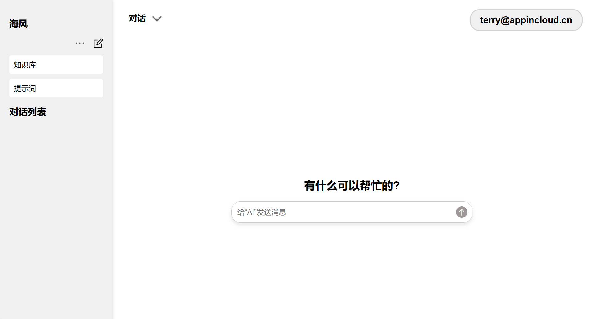
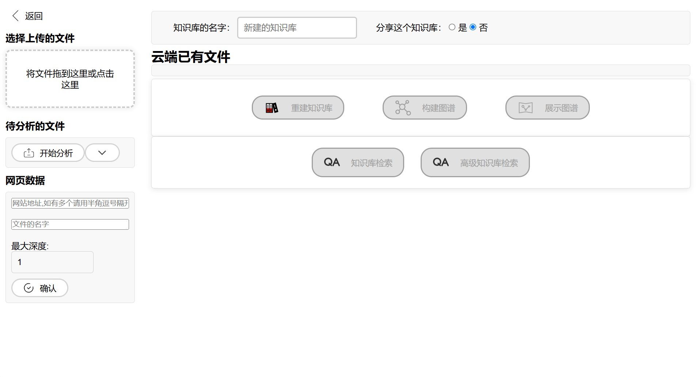

[English](README.md) ｜ 中文

# OpenKAG (Open Knowledge Augmented Generation)
## 一、简介
### OpenKAG，是基于大模型技术开发的企业智能知识中台，具备开源、可私有化部署、支持多模态等特点，支持对图片以及PDF等文档进行预处理与分析，同时是国内首个融合知识图谱与大模型RAG落地应用的企业知识助手。
### 平台旨在打造企业自主可控、开箱即用、离线运行、数据安全的企业知识中台。

### 关键功能
###### 在对话功能中，系统提供了两种知识库检索模式供用户选择。其中，常规的知识库检索模式（Rag检索）已经能够满足大部分的查询需求。然而，对于那些需要更详细、更全面、更准确信息的用户，高级知识库检索模式（Graphrag）则提供了更为强大的支持。

#### 检索增强生成（RAG）
检索增强生成 (RAG) 是一种 AI 框架，它结合了两种技术：首先，它从数据库、文档或 Web 等外部源检索相关信息；收集到相关信息后，就会将其用于指导和增强生成的回复。这种方法充分利用了检索和生成技术的优势，确保了回复的准确性和相关性，并通过最新的具体信息丰富了上下文。这种双重能力使得 RAG 系统能够生成比纯生成模型更有依据、更细致的输出。


#### 高级知识库检索模式（GraphRAG）
 1. **解决大模型的“幻觉”问题**：大模型存在幻觉的问题主要在于人类输入的信息不够全面，导致理解上的歧义。知识图谱通过结构化的“知识社区”的方式将知识系统性地输入给大模型进行参考，能有效解决大模型地“幻觉”问题。
 2. **更加全面的答案**：经常使用大模型的人都知道，输入的参考资料越多，问题越明确，大模型的回答就越准确。普通RAG使用“相似性”搜索给出的资料可能并不与问题直接相关，导致误导大模型的回答。而知识图谱天生具备了知识间的相关性，比如在上面的例子中，即使非常模糊的问题，也能通过知识图谱检索到全面的信息。
 3. **无限的上下文**：通过知识的图谱化，系统可以随时提取到与问题相关联的数据，这相当于给大模型的回答增加了无限的上下文长度，当需要使用到的时候在图谱中进行获取。这就像我们可以随时在整座图书馆中找到我们需要的书，阅读，理解，并给出回答。


#### 对网站信息的直接爬取和总结
对于很多使用场景，用户不一定有对应数据和信息的文档，用户很有可能需要从网站上去爬取信息，我们提供了一个便捷爬取网站并进行RAG总结的功能，注意，这个爬取并不会爬取图片



### 在线体验
点击进入我们的在线demo
[https://chat.llmincloud.com:8010](https://chat.llmincloud.com:8010)

OpenKAG由海风大模型/云中致用开发，使用数字人技术及许多开源软件，特此鸣谢。

## 二、安装OpenKAG

# 1.创建新的虚拟环境
```bash
conda create --name haifengai python=3.10
conda activate haifengai
```
> 提醒：python的版本应 >=3.10


# 2. 配置环境
> 提醒：安装系统所需依赖包时，需要按步骤的循序执行，否值会有错误！
## 2.1 安装依赖包
```bash
cd haifeng-llm
pip install -r requirements.txt
```
## 2.2 安装Graphrag依赖包
```bash
pip install git+https://github.com/Good1521/graphrag.git
```
## 2.3 安装启动EMBEDDING模型的依赖包（如需要）
```bash
pip install --no-cache-dir langchain_community open-text-embeddings[server]
```

> 提醒：这个包的作用是快速启动EMBEDDING模型，如果你已经启动了或者有更好的方法则不需要安装这个包。
>
> 您可以参考  [limcheekin's open-text-embeddings](https://github.com/limcheekin/open-text-embeddings)  来深入了解这个包。
## 2.4 下载必要models
```bash
chmod +x download_models.sh
./download_models.sh
```

# 3. 修改配置文件信息
```bash
copy settings.example.py settings.py
```

## 3.1 修改 `settings.py` 文件

### 3.1.1 修改模型 API 地址

- **本地模型**：如果使用本地模型，请将路径中的 `localhost` 改为本地的实际地址。  
- **线上模型**：如果使用线上的模型，请修改为对应的 API 访问地址。
请修改如下设置：
```
VLLM_API_BASE_URL 大模型的API接入地址
MODEL_NAME 大模型名称
API_KEY API密钥
MULTIMODAL_BASE_URL 多模态大模型的API接入地址
MULTIMODAL_API_KEY 多模态大模型的API密钥
GRAPHRAG_EMBEDDING_API_BASE_URL 词嵌入的API接入地址，本项目内置了一个第三方的开源项目，如果照安装指南操作的话，保留缺省配置即可。
GRAPHRAG_EMBEDDING_API_KEY  词嵌入的API密钥
```

### 3.1.2 修改邮箱设置
1. 打开以下的配置文件： **`settings.py`**
2. 定位到邮箱设置部分，修改为实际的邮箱信息。
>提示：邮箱的设置用于忘记账号时发送邮件。需要自行开通POP3/IMAP/SMTP服务


### 3.1.3 修改数据库类型
> 默认的数据库是mongodb，本系统还支持sqlite。如果为mongodb请先安装和启动mongodb的服务，然后将DB_DEFAULT改为"mongo"。
> 如果为sqlite，将DB_DEFAULT改为"sqlite"。
> 您可以参考  [mongodb's mongo](https://github.com/mongodb/mongo)  来安装mongodb


## 3.2 修改 Graphrag 的配置文件

### 3.2.1 修改 `settings.yaml` 文件

1. 打开以下路径的配置文件：  
   **`store/default_setting/settings.yaml`**
2. 修改以下参数为所需的值：
   - **`llm:`**  
     设置与语言模型相关的参数。
   - **`embeddings:`**  
     设置与嵌入模型相关的参数。  

   示例：
   ```yaml
   llm:
     model: "deepseek-chat"
     api_base: "https://example.com/api"

   embeddings:
     llm:
       model: "text-embedding-3-small"
       api_base: "https://example.com/api"
### 3.2.2 修改 `.env` 文件

1. 打开以下路径的配置文件： **`store/default_setting/.env`**

2. 修改以下键值为实际需要的内容：  
   - **`GRAPHRAG_API_KEY`** : 设置 Graphrag 的 API 密钥。
   - **`GRAPHRAG_EMBEDDING_API_KEY`** : 设置 Graphrag 嵌入模型的 API 密钥。
## 3.3 启动backend (需要依赖于操作部署2.4，下载完模型)
- 启动asr
  ```bash 
    cd backend
    conda create -n asr python=3.10 
    conda activate asr
    pip install openai-whisper soundfile numpy fastapi python-multipart requests uvicorn
    python asrapi.py
  ```
- 启动本地Embedding模型
  ```bash 
    cd models
    MODEL=bge-large-zh-v1.5 VERBOSE=1 PORT=8016 python -m open.text.embeddings.server
  ```

# 启动
  ```bash 
    uvicorn index:app --host 0.0.0.0 --port 8000
  ```
  > 如果需要用https访问则需要添加参数，则需要在启动是加上以下两个证书参数
  >
  > --ssl-keyfile 网站证书的密钥
  >
  > --ssl-certfile 网站证书

# 访问

浏览器打开http://host:port，有证书则打开https://host:port。
